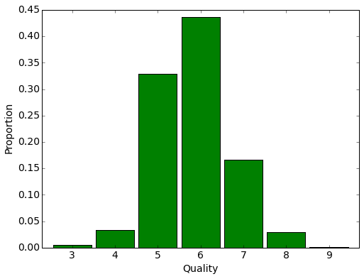
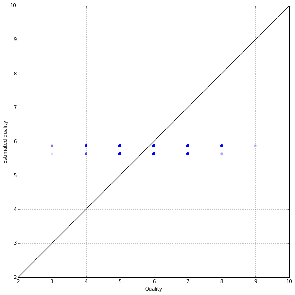
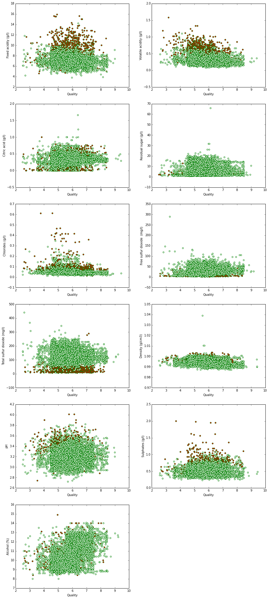
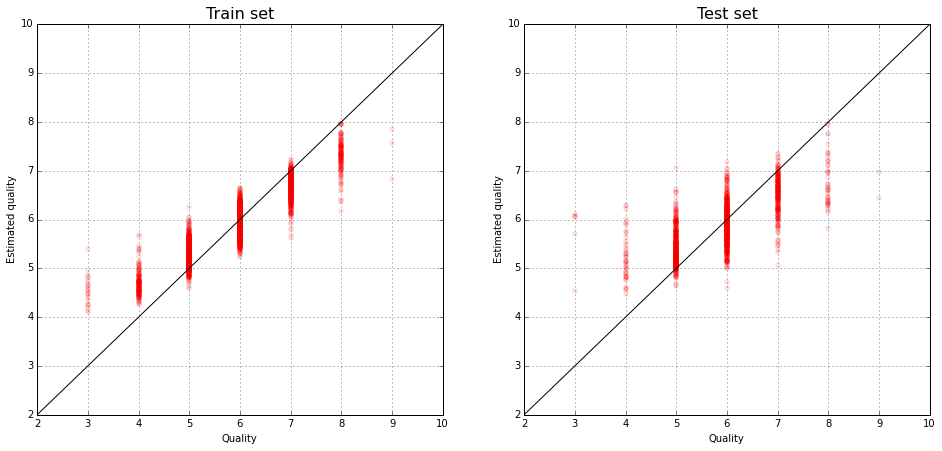

# Modeling wine preferences by data mining from physicochemical properties
## Linear Regression and Random Forest

In this work we will use data mining techniques on collected wine sets and
evaluate wine quality by given raw data.

Wine can be classified by human experts or by physicochemical laboratory tests – pH or alcohol values or
density determination.

But there is another method how to classify wine. 

Input variables (based on physicochemical tests):

   1 - fixed acidity
   
   2 - volatile acidity
   
   3 - citric acid
   
   4 - residual sugar
   
   5 - chlorides
   
   6 - free sulfur dioxide
   
   7 - total sulfur dioxide
   
   8 - density
   
   9 - pH
   
   10 - sulphates
   
   11 - alcohol
   
   
   
Output variable (based on sensory data):

   12 - quality (score between 0 and 10)


```python
from sklearn.cross_validation import train_test_split
from sklearn.linear_model import LinearRegression
from sklearn.metrics import mean_squared_error
from sklearn.ensemble import RandomForestRegressor

import numpy as np
import pandas as pd
import statsmodels.stats.api as sm

%pylab inline
```

    Populating the interactive namespace from numpy and matplotlib


```python
# Read data
wine = pd.read_csv('wine_data.csv', sep='\t')
```


```python
wine.head()
```


<div>
<table border="1" class="dataframe">
  <thead>
    <tr style="text-align: right;">
      <th></th>
      <th>Type</th>
      <th>Fixed acidity (g/l)</th>
      <th>Volatile acidity (g/l)</th>
      <th>Citric acid (g/l)</th>
      <th>Residual sugar (g/l)</th>
      <th>Chlorides (g/l)</th>
      <th>Free sulfur dioxide  (mg/l)</th>
      <th>Total sulfur dioxide (mg/l)</th>
      <th>Density (g/cm3)</th>
      <th>pH</th>
      <th>Sulphates (g/l)</th>
      <th>Alcohol (%)</th>
      <th>quality</th>
    </tr>
  </thead>
  <tbody>
    <tr>
      <th>0</th>
      <td>red</td>
      <td>7.4</td>
      <td>0.70</td>
      <td>0.00</td>
      <td>1.9</td>
      <td>0.076</td>
      <td>11</td>
      <td>34</td>
      <td>0.9978</td>
      <td>3.51</td>
      <td>0.56</td>
      <td>9.4</td>
      <td>5</td>
    </tr>
    <tr>
      <th>1</th>
      <td>red</td>
      <td>7.8</td>
      <td>0.88</td>
      <td>0.00</td>
      <td>2.6</td>
      <td>0.098</td>
      <td>25</td>
      <td>67</td>
      <td>0.9968</td>
      <td>3.20</td>
      <td>0.68</td>
      <td>9.8</td>
      <td>5</td>
    </tr>
    <tr>
      <th>2</th>
      <td>red</td>
      <td>7.8</td>
      <td>0.76</td>
      <td>0.04</td>
      <td>2.3</td>
      <td>0.092</td>
      <td>15</td>
      <td>54</td>
      <td>0.9970</td>
      <td>3.26</td>
      <td>0.65</td>
      <td>9.8</td>
      <td>5</td>
    </tr>
    <tr>
      <th>3</th>
      <td>red</td>
      <td>11.2</td>
      <td>0.28</td>
      <td>0.56</td>
      <td>1.9</td>
      <td>0.075</td>
      <td>17</td>
      <td>60</td>
      <td>0.9980</td>
      <td>3.16</td>
      <td>0.58</td>
      <td>9.8</td>
      <td>6</td>
    </tr>
    <tr>
      <th>4</th>
      <td>red</td>
      <td>7.4</td>
      <td>0.70</td>
      <td>0.00</td>
      <td>1.9</td>
      <td>0.076</td>
      <td>11</td>
      <td>34</td>
      <td>0.9978</td>
      <td>3.51</td>
      <td>0.56</td>
      <td>9.4</td>
      <td>5</td>
    </tr>
  </tbody>
</table>
</div>


We see 11 signs describing the chemical composition of the wines.
Here is the distribution of expert evaluation of wines in the sample:


```python
plt.figure(figsize(8,6))
stat = wine.groupby('quality')['quality'].agg(lambda x : float(len(x))/wine.shape[0])
stat.plot(kind='bar', fontsize=14, width=0.9, color="green")
plt.xticks(rotation=0)
plt.ylabel('Proportion', fontsize=14)
plt.xlabel('Quality', fontsize=14)
```


    <matplotlib.text.Text at 0x7f20f8773350>





# Type and Quality of Wine


```python
y = wine[['Type', 'quality']]
y.head()
```


<div>
<table border="1" class="dataframe">
  <thead>
    <tr style="text-align: right;">
      <th></th>
      <th>Type</th>
      <th>quality</th>
    </tr>
  </thead>
  <tbody>
    <tr>
      <th>0</th>
      <td>red</td>
      <td>5</td>
    </tr>
    <tr>
      <th>1</th>
      <td>red</td>
      <td>5</td>
    </tr>
    <tr>
      <th>2</th>
      <td>red</td>
      <td>5</td>
    </tr>
    <tr>
      <th>3</th>
      <td>red</td>
      <td>6</td>
    </tr>
    <tr>
      <th>4</th>
      <td>red</td>
      <td>5</td>
    </tr>
  </tbody>
</table>
</div>


```python
wine.groupby('Type')['Type'].count()
```


    Type
    red      1599
    white    4898
    Name: Type, dtype: int64


We separate 25% of the set for the quality prediction control.


```python
from sklearn.cross_validation import train_test_split

X_train, X_test, y_train, y_test = train_test_split(wine.ix[:, wine.columns != 'quality'], 
                                                    wine['quality'], 
                                                    test_size=0.25)
```


```python
X_train['Type'] = X_train['Type'].apply(lambda x : -1 if x == 'red' else 1)
X_test['Type'] = X_test['Type'].apply(lambda x : -1 if x == 'red' else 1)
```

If we do not have any more information about the wines, our best guess on the assessment – - the average, available in the training set:


```python
np.mean(y_train)
```


    5.8169129720853858


If we predict this value assessment of all the winse oin the training set, we get the average square error.


```python
sqrt(mean_squared_error([np.mean(y_train)]*len(y_train), y_train))
```


    0.87670621485856171


and on the test


```python
sqrt(mean_squared_error([np.mean(y_train)]*len(y_test), y_test))
```


    0.8625590794770277


On the test sample the error is greater, since we evaluate the average by the teaching. This is a natural effect.
To clarify our prediction, it is possible to predict the value of every wine by the average estimation of wines of the same type in the sample:


```python
regressor = LinearRegression()
regressor.fit(X_train['Type'].reshape(-1,1), y_train)
```


    LinearRegression(copy_X=True, fit_intercept=True, n_jobs=1, normalize=False)


```python
y_train_predictions = regressor.predict(X_train['Type'].reshape(-1,1))
```


```python
y_test_predictions = regressor.predict(X_test['Type'].reshape(-1,1))
```

Prediction errors have decreased slightly:


```python
sqrt(mean_squared_error(y_train_predictions, y_train))
```


    0.87064224152662018


```python
sqrt(mean_squared_error(y_test_predictions, y_test))
```


    0.85579069866207058


Here is the true evaluation of wines and their average prediction by the types on a test sample:


```python
pyplot.figure(figsize(10,10))
pyplot.scatter(y_test, y_test_predictions, color="blue", alpha=0.1)
pyplot.xlim(2,10)
pyplot.ylim(2,10)
plot(range(11), color='black')
grid()
plt.xlabel('Quality')
plt.ylabel('Estimated quality')
```


    <matplotlib.text.Text at 0x7f20dd856f10>





```python
def fun(v):
    return v + np.random.uniform(low=-0.5, 
                                 high=0.5, 
                                 size=len(v))

pyplot.figure(figsize(15, 35))
for i in range (1, 12):
    pyplot.subplot(6, 2, i)
    pyplot.scatter(fun(wine['quality']), wine.ix[:, i], 
                   color=wine["Type"], 
                   edgecolors="green")
    pyplot.xlabel('Quality')
    pyplot.ylabel(str(wine.columns[i]))
```





## Linear Regression

To begin with, let us construct the linear regression model.


```python
lm = LinearRegression()
lm.fit(X_train, y_train)
```


    LinearRegression(copy_X=True, fit_intercept=True, n_jobs=1, normalize=False)


The prediction errors were essentially reduced:


```python
sqrt(mean_squared_error(lm.predict(X_train), y_train))
```


    0.73840949206442807


```python
sqrt(mean_squared_error(lm.predict(X_test), y_test))
```


    0.71457788648123488


The true evaluation of wines and their predictions by the linear model:


```python
plt.figure(figsize(16,8))
plt.subplot(121)
pyplot.scatter(y_train, lm.predict(X_train), color="red", alpha=0.1)
pyplot.xlim(2,10)
pyplot.ylim(2,10)
plot(range(11), color='black')
grid()
pyplot.title('Train set', fontsize=16)
pyplot.xlabel('Quality')
pyplot.ylabel('Estimated quality')

plt.subplot(122)
pyplot.scatter(y_test, lm.predict(X_test), color="red", alpha=0.1)
pyplot.xlim(2,10)
pyplot.ylim(2,10)
plot(range(11), color='black')
grid()
pyplot.title('Test set', fontsize=16)
pyplot.xlabel('Quality')
pyplot.ylabel('Estimated quality')
```


    <matplotlib.text.Text at 0x7f2087f41190>


We calculate the coefficient of determination - the proportion by the explained model of the disperse response.


```python
lm.score(X_test, y_test)
```


    0.31365659929719758


 ## Random Forest

We construct the random forest on the teaching set:


```python
rf = RandomForestRegressor(n_estimators=100, min_samples_leaf=3)
```


```python
rf.fit(X_train, y_train)
```


    RandomForestRegressor(bootstrap=True, criterion='mse', max_depth=None,
               max_features='auto', max_leaf_nodes=None, min_samples_leaf=3,
               min_samples_split=2, min_weight_fraction_leaf=0.0,
               n_estimators=100, n_jobs=1, oob_score=False, random_state=None,
               verbose=0, warm_start=False)


The quality has increased, though the model has been retrained.


```python
sqrt(mean_squared_error(rf.predict(X_train), y_train))
```


    0.35262460471153395


```python
sqrt(mean_squared_error(rf.predict(X_test), y_test))
```


    0.60694168473930055


The true evaluation of wines and their predictions by the random forest:


```python
plt.figure(figsize(16,7))
plt.subplot(121)
pyplot.scatter(y_train, rf.predict(X_train), color="red", alpha=0.1)
pyplot.xlim(2,10)
pyplot.ylim(2,10)
plot(range(11), color='black')
grid()
pyplot.title('Train set', fontsize=16)
pyplot.xlabel('Quality')
pyplot.ylabel('Estimated quality')

plt.subplot(122)
pyplot.scatter(y_test, rf.predict(X_test), color="red", alpha=0.1)
pyplot.xlim(2,10)
pyplot.ylim(2,10)
plot(range(11), color='black')
grid()
pyplot.title('Test set', fontsize=16)
pyplot.xlabel('Quality')
pyplot.ylabel('Estimated quality')
```


    <matplotlib.text.Text at 0x7f20878b3ad0>





The coefficient of determination for the random forest:


```python
rf.score(X_test, y_test)
```


    0.50485060884990918


We compare the errors of the linear regression and random forest on a test sample:


```python
plt.figure(figsize(8,6))
plt.hist(abs(y_test - lm.predict(X_test)) - abs(y_test - rf.predict(X_test)), bins=16, normed=True)
plt.xlabel('Difference of absolute errors')
```


    <matplotlib.text.Text at 0x7f208792e510>


The differences between the average absolute errors are significant:


```python
tmeans = sm.CompareMeans(sm.DescrStatsW(abs(y_test - lm.predict(X_test))), 
                         sm.DescrStatsW(abs(y_test - rf.predict(X_test))))

tmeans.ttest_ind(alternative='two-sided', usevar='pooled', value=0)[1]
```


    6.0766386407976045e-13


95% confidence interval for the average difference of absolute errors.


```python
tmeans.tconfint_diff(alpha=0.05, alternative='two-sided', usevar='pooled')
```


    (0.079701943166600675, 0.13903686377836694)


That is, using our random forest instead of linear regression, we predict the expert evaluation more accurately.
Let’s see what signs have the greatest predictive power:


```python
importances = pd.DataFrame(zip(X_train.columns, rf.feature_importances_))
importances.columns = ['feature name', 'importance']
importances.sort(ascending=False)
```

The alcohol content has the greatest influence on the expert evaluation of wine quality.

# Conclusion
In this work we solved the regression problem. The algorithms we chose are called linear regression and random forest. We predict that random forest has a better value. It is more exact. The alcohol content has the greatest influence on the expert evaluation of wine quality.
The prediction model in this work can bear quite good results.


# Reference
Citation Request:
  This dataset is public available for research. The details are described in [Cortez et al., 2009]. 
  Please include this citation if you plan to use this database:

  P. Cortez, A. Cerdeira, F. Almeida, T. Matos and J. Reis. 
  Modeling wine preferences by data mining from physicochemical properties.
  In Decision Support Systems, Elsevier, 47(4):547-553. ISSN: 0167-9236.

  Available at: [@Elsevier] http://dx.doi.org/10.1016/j.dss.2009.05.016
                [bib] http://www3.dsi.uminho.pt/pcortez/dss09.bib


```python

```
